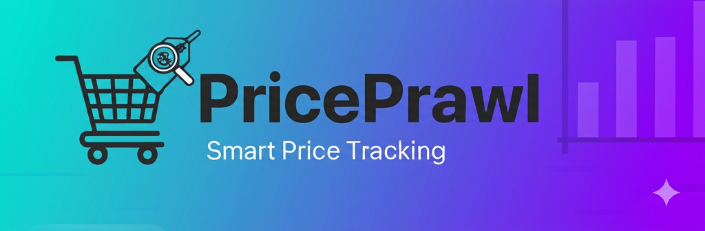

# PricePrawl

## Smart Price Tracking Across Multiple E-Commerce Platforms



PricePrawl is a comprehensive price tracking application that helps users monitor product prices across multiple e-commerce platforms. With real-time price tracking, historical price charts, and customizable alerts, PricePrawl empowers users to make informed purchasing decisions and save money.

## 📋 Table of Contents

- [Features](#features)
- [Technology Stack](#technology-stack)
- [Installation](#installation)
- [Configuration](#configuration)
- [Usage](#usage)
- [Database Schema](#database-schema)
- [API Integration](#api-integration)
- [User Authentication](#user-authentication)
- [Supported Retailers](#supported-retailers)
- [Contributing](#contributing)
- [License](#license)

## ✨ Features

### 🔍 Price Tracking
- **Multi-Platform Monitoring**: Track prices across dozens of popular e-commerce sites
- **Historical Price Data**: View price trends over time with interactive charts
- **Price Drop Detection**: Automatically identify significant price reductions

### 🔔 Alerts System
- **Custom Price Alerts**: Set target prices and get notified when they're reached
- **Email Notifications**: Receive timely alerts via email when prices drop
- **Alert Management**: Easily view, edit, and delete your price alerts

### 📊 Product Information
- **Detailed Product Views**: Comprehensive product information and specifications
- **Price Comparison**: Compare prices across multiple retailers
- **Similar Products**: View alternative products with similar features

### 👤 User Account Management
- **Secure Registration**: Email verification with OTP (One-Time Password)
- **User Profiles**: Customize account settings and preferences
- **Password Recovery**: Secure password reset functionality

### 📱 User Experience
- **Responsive Design**: Optimized for both desktop and mobile devices
- **Dark Mode Support**: Toggle between light and dark themes
- **Wishlist Management**: Save and organize products of interest

### 🔍 Search and Discovery
- **Product Search**: Find products across multiple platforms
- **Trending Products**: Discover popular items being tracked
- **Price Drop Highlights**: View products with recent significant discounts

## 🛠️ Technology Stack

- **Frontend**: HTML, CSS, JavaScript, Tailwind CSS, Alpine.js
- **Backend**: PHP 7.4+
- **Database**: MySQL
- **Email Service**: PHPMailer
- **APIs**: Integration with BuyHatke API for price data
- **Visualization**: Highcharts for price history charts
- **Authentication**: Custom secure authentication system

## 📥 Installation

1. **Clone the repository**
   ```
   git clone https://github.com/harshraj001/Price-Prawl
   ```

2. **Database Setup**
   - Create a MySQL database
   - Import the database schema from `database_schema.sql`

3. **Configuration**
   - Create a `config.php` file in the `includes` directory
   - Set your database credentials and other configuration variables

4. **Dependencies**
   - Install dependencies using Composer:
   ```
   composer install
   ```

5. **Server Configuration**
   - Configure your web server (Apache/Nginx) to serve the application
   - Ensure PHP 7.4+ is installed with required extensions

## ⚙️ Configuration

Update the `includes/config.php` file with your specific configuration:

```php
// Database Configuration
define('DB_HOST', 'localhost');
define('DB_NAME', 'priceprawl');
define('DB_USER', 'your_username');
define('DB_PASS', 'your_password');

// Email Configuration
define('SMTP_HOST', 'smtp.example.com');
define('SMTP_PORT', 587);
define('SMTP_USER', 'your_email@example.com');
define('SMTP_PASS', 'your_password');
define('MAIL_FROM', 'noreply@priceprawl.com');
define('MAIL_FROM_NAME', 'PricePrawl');

// API Configuration
define('API_PROXY', 'https://cors-ninja.harshraj864869.workers.dev/proxy?url=');
define('API_BASE_PATH', 'https://buyhatke.com/price-history-deals');
```

## 🚀 Usage

1. **User Registration**
   - Navigate to the registration page
   - Enter your details and verify your email with the OTP

2. **Searching for Products**
   - Use the search bar to find products
   - Browse trending products or price drops

3. **Product Tracking**
   - View detailed product information
   - Add products to your wishlist for tracking

4. **Setting Alerts**
   - Set price alerts for products in your wishlist
   - Receive notifications when prices reach your target

5. **Managing Your Account**
   - Access your account settings
   - Manage your wishlist and alerts

## 📊 Database Schema

The application uses a normalized database schema:

- **users**: Stores user account information and authentication data
- **user_preferences**: Contains user-specific settings and preferences
- **wishlist_items**: Tracks products saved by users
- **price_alerts**: Maintains alert conditions for specific products
- **price_history**: Records historical price data for tracked products
- **alert_notifications**: Logs notifications sent to users
- **remember_tokens**: Manages "Remember Me" functionality
- **password_reset_tokens**: Handles secure password reset process

## 🔌 API Integration

PricePrawl integrates with external APIs to fetch product data:

1. **Product Information**
   - Basic details like name, image, and current price
   - Product specifications and descriptions
   - Retailer information

2. **Price Data**
   - Current prices across multiple retailers
   - Historical price charts
   - Price drop percentages

3. **Similar Products**
   - Products with similar features
   - Alternative options at different price points

## 🔐 User Authentication

The authentication system includes:

- **Secure Registration**: Email verification with time-limited OTP
- **Login Security**: Password hashing and protection against brute force attacks
- **Session Management**: Secure session handling with remember-me functionality
- **Password Recovery**: Time-limited tokens for password reset

## 🛒 Supported Retailers

PricePrawl tracks prices across numerous Indian e-commerce platforms, including:

- Amazon India
- Flipkart
- Myntra
- AJIO
- Tata CLiQ
- JioMart
- Croma
- Reliance Digital
- Nykaa
- Pepperfry
- Lenskart
- Decathlon
- And many more!

## 🤝 Contributing

We welcome contributions to PricePrawl! Here's how you can help:

1. Fork the repository
2. Create a feature branch (`git checkout -b feature/amazing-feature`)
3. Commit your changes (`git commit -m 'Add some amazing feature'`)
4. Push to the branch (`git push origin feature/amazing-feature`)
5. Open a Pull Request

## 📄 License

This project is licensed under the MIT License - see the LICENSE file for details.

---

© 2025 PricePrawl. All rights reserved.
